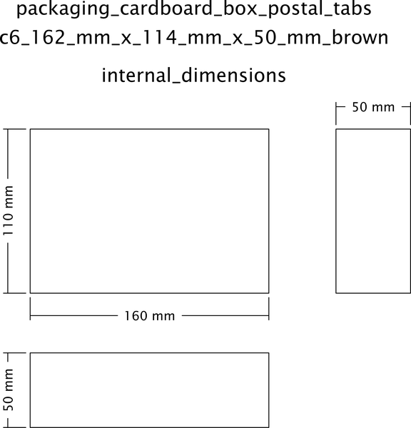

# Packaging Cardboard Box Postal Tabs C6 162 mm X 114 mm X 50 mm Brown  

note: This is part of OOMP the Oopen Organization Method For Parts. For more details: https://github.com/oomlout/oomp_base

##  part details

### id
* oomp_id: packaging_cardboard_box_postal_tabs_c6_162_mm_x_114_mm_x_50_mm_brown
  * classification: packaging
  * type: cardboard_box_postal_tabs
  * size: c6_162_mm_x_114_mm_x_50_mm
  * color: brown
  * description_main: 
  * description_extra: 
  * manufacturer: 
  * part_number: 

### other_codes
* short_code: 
* oomp_word: ramen ring mushroom
* oomp_word_emoji :ramen: :ring: :mushroom:
* md5_6_alpha: 7frl4
* md5_6: bea068

### all codes 
|classification|packaging|
|classification_length_1|p|
|classification_length_2|pa|
|classification_length_3|pac|
|classification_length_4|pack|
|classification_length_5|packa|
|classification_length_6|packag|
|classification_name|Packaging|
|classification_no_space_length_1|p|
|classification_no_space_length_2|pa|
|classification_no_space_length_3|pac|
|classification_no_space_length_4|pack|
|classification_no_space_length_5|packa|
|classification_no_space_length_6|packag|
|classification_no_space_upper_length_1|P|
|classification_no_space_upper_length_2|PA|
|classification_no_space_upper_length_3|PAC|
|classification_no_space_upper_length_4|PACK|
|classification_no_space_upper_length_5|PACKA|
|classification_no_space_upper_length_6|PACKAG|
|classification_upper_length_1|P|
|classification_upper_length_2|PA|
|classification_upper_length_3|PAC|
|classification_upper_length_4|PACK|
|classification_upper_length_5|PACKA|
|classification_upper_length_6|PACKAG|
|color|brown|
|color_length_1|b|
|color_length_2|br|
|color_length_3|bro|
|color_length_4|brow|
|color_length_5|brown|
|color_length_6|brown|
|color_name|Brown|
|color_no_space_length_1|b|
|color_no_space_length_2|br|
|color_no_space_length_3|bro|
|color_no_space_length_4|brow|
|color_no_space_length_5|brown|
|color_no_space_length_6|brown|
|color_no_space_upper_length_1|B|
|color_no_space_upper_length_2|BR|
|color_no_space_upper_length_3|BRO|
|color_no_space_upper_length_4|BROW|
|color_no_space_upper_length_5|BROWN|
|color_no_space_upper_length_6|BROWN|
|color_upper_length_1|B|
|color_upper_length_2|BR|
|color_upper_length_3|BRO|
|color_upper_length_4|BROW|
|color_upper_length_5|BROWN|
|color_upper_length_6|BROWN|
|description_extra||
|description_extra_name||
|description_main||
|description_main_name||
|directory|parts/packaging_cardboard_box_postal_tabs_c6_162_mm_x_114_mm_x_50_mm_brown|
|github_link|https://github.com/oomlout/oomlout_oomp_part_src/tree/main/parts/packaging_cardboard_box_postal_tabs_c6_162_mm_x_114_mm_x_50_mm_brown|
|id|packaging_cardboard_box_postal_tabs_c6_162_mm_x_114_mm_x_50_mm_brown|
|id_no_class|cardboard_box_postal_tabs_c6_162_mm_x_114_mm_x_50_mm_brown|
|id_no_color|brown|
|id_no_size|brown|
|id_no_type|c6_162_mm_x_114_mm_x_50_mm_brown|
|manufacturer||
|manufacturer_name||
|md5|bea068f60f8d48e04545c9377be0791f|
|md5_10|bea068f60f|
|md5_10_upper|BEA068F60F|
|md5_5|bea06|
|md5_5_upper|BEA06|
|md5_6|bea068|
|md5_6_alpha|7frl4|
|md5_6_alpha_upper|7FRL4|
|md5_6_upper|BEA068|
|name|Packaging Cardboard Box Postal Tabs C6 162 mm X 114 mm X 50 mm Brown|
|name_no_class|Cardboard Box Postal Tabs C6 162 mm X 114 mm X 50 mm Brown|
|name_no_color|Brown|
|name_no_size|Brown|
|name_no_type|C6 162 mm X 114 mm X 50 mm Brown|
|oomp_key|oomp_packaging_cardboard_box_postal_tabs_c6_162_mm_x_114_mm_x_50_mm_brown|
|oomp_word|ramen ring mushroom|
|oomp_word_emoji|:ramen: :ring: :mushroom:|
|oomp_word_emoji_list|[':ramen:', ':ring:', ':mushroom:']|
|oomp_word_list|['ramen', 'ring', 'mushroom']|
|part_number||
|part_number_name||
|size|c6_162_mm_x_114_mm_x_50_mm|
|size_length_1|c|
|size_length_2|c6|
|size_length_3|c6_|
|size_length_4|c6_1|
|size_length_5|c6_16|
|size_length_6|c6_162|
|size_name|C6 162 mm X 114 mm X 50 mm|
|size_no_space_length_1|c|
|size_no_space_length_2|c6|
|size_no_space_length_3|c61|
|size_no_space_length_4|c616|
|size_no_space_length_5|c6162|
|size_no_space_length_6|c6162m|
|size_no_space_upper_length_1|C|
|size_no_space_upper_length_2|C6|
|size_no_space_upper_length_3|C61|
|size_no_space_upper_length_4|C616|
|size_no_space_upper_length_5|C6162|
|size_no_space_upper_length_6|C6162M|
|size_upper_length_1|C|
|size_upper_length_2|C6|
|size_upper_length_3|C6_|
|size_upper_length_4|C6_1|
|size_upper_length_5|C6_16|
|size_upper_length_6|C6_162|
|type|cardboard_box_postal_tabs|
|type_length_1|c|
|type_length_2|ca|
|type_length_3|car|
|type_length_4|card|
|type_length_5|cardb|
|type_length_6|cardbo|
|type_name|Cardboard Box Postal Tabs|
|type_no_space_length_1|c|
|type_no_space_length_2|ca|
|type_no_space_length_3|car|
|type_no_space_length_4|card|
|type_no_space_length_5|cardb|
|type_no_space_length_6|cardbo|
|type_no_space_upper_length_1|C|
|type_no_space_upper_length_2|CA|
|type_no_space_upper_length_3|CAR|
|type_no_space_upper_length_4|CARD|
|type_no_space_upper_length_5|CARDB|
|type_no_space_upper_length_6|CARDBO|
|type_upper_length_1|C|
|type_upper_length_2|CA|
|type_upper_length_3|CAR|
|type_upper_length_4|CARD|
|type_upper_length_5|CARDB|
|type_upper_length_6|CARDBO|
|files|['base.yaml', 'dimension.cdr', 'dimension.pdf', 'dimension.png', 'dimension.svg', 'dimension_300.png', 'dimension_600.png', 'drawing.cdr', 'drawing.pdf', 'drawing.svg', 'working.yaml']|
