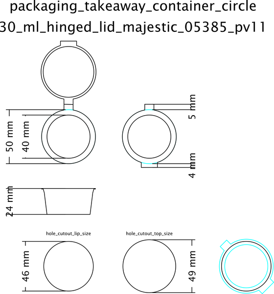
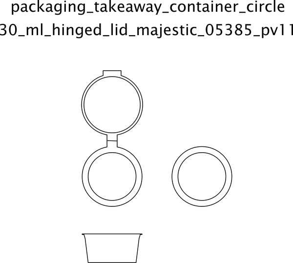

# Packaging Takeaway Container Circle 30 Ml Hinged Lid Majestic 05385 Pv11  

note: This is part of OOMP the Oopen Organization Method For Parts. For more details: https://github.com/oomlout/oomp_base

##  part details

### id
* oomp_id: packaging_takeaway_container_circle_30_ml_hinged_lid_majestic_05385_pv11
  * classification: packaging
  * type: takeaway_container_circle
  * size: 30_ml
  * color: 
  * description_main: hinged_lid
  * description_extra: 
  * manufacturer: majestic
  * part_number: 05385_pv11

### other_codes
* short_code: tcc30hl
* oomp_word: ok corn stars
* oomp_word_emoji :ok: :corn: :stars:
* md5_6_alpha: 9tql9
* md5_6: fbd4dd

### all codes 
| key | value |  
| --- | --- |  
| classification | packaging |  
| classification_length_1 | p |  
| classification_length_2 | pa |  
| classification_length_3 | pac |  
| classification_length_4 | pack |  
| classification_length_5 | packa |  
| classification_length_6 | packag |  
| classification_name | Packaging |  
| classification_no_space_length_1 | p |  
| classification_no_space_length_2 | pa |  
| classification_no_space_length_3 | pac |  
| classification_no_space_length_4 | pack |  
| classification_no_space_length_5 | packa |  
| classification_no_space_length_6 | packag |  
| classification_no_space_upper_length_1 | P |  
| classification_no_space_upper_length_2 | PA |  
| classification_no_space_upper_length_3 | PAC |  
| classification_no_space_upper_length_4 | PACK |  
| classification_no_space_upper_length_5 | PACKA |  
| classification_no_space_upper_length_6 | PACKAG |  
| classification_upper_length_1 | P |  
| classification_upper_length_2 | PA |  
| classification_upper_length_3 | PAC |  
| classification_upper_length_4 | PACK |  
| classification_upper_length_5 | PACKA |  
| classification_upper_length_6 | PACKAG |  
| color |  |  
| color_name |  |  
| description_extra |  |  
| description_extra_name |  |  
| description_main | hinged_lid |  
| description_main_length_1 | h |  
| description_main_length_2 | hi |  
| description_main_length_3 | hin |  
| description_main_length_4 | hing |  
| description_main_length_5 | hinge |  
| description_main_length_6 | hinged |  
| description_main_name | Hinged Lid |  
| description_main_no_space_length_1 | h |  
| description_main_no_space_length_2 | hi |  
| description_main_no_space_length_3 | hin |  
| description_main_no_space_length_4 | hing |  
| description_main_no_space_length_5 | hinge |  
| description_main_no_space_length_6 | hinged |  
| description_main_no_space_upper_length_1 | H |  
| description_main_no_space_upper_length_2 | HI |  
| description_main_no_space_upper_length_3 | HIN |  
| description_main_no_space_upper_length_4 | HING |  
| description_main_no_space_upper_length_5 | HINGE |  
| description_main_no_space_upper_length_6 | HINGED |  
| description_main_upper_length_1 | H |  
| description_main_upper_length_2 | HI |  
| description_main_upper_length_3 | HIN |  
| description_main_upper_length_4 | HING |  
| description_main_upper_length_5 | HINGE |  
| description_main_upper_length_6 | HINGED |  
| directory | parts/packaging_takeaway_container_circle_30_ml_hinged_lid_majestic_05385_pv11 |  
| github_link | https://github.com/oomlout/oomlout_oomp_part_src/tree/main/parts/packaging_takeaway_container_circle_30_ml_hinged_lid_majestic_05385_pv11 |  
| id | packaging_takeaway_container_circle_30_ml_hinged_lid_majestic_05385_pv11 |  
| id_no_class | takeaway_container_circle_30_ml_hinged_lid_majestic_05385_pv11 |  
| id_no_color | hingedlidmajestic05385pv11 |  
| id_no_size | hinged_lid_majestic_05385_pv11 |  
| id_no_type | 30_ml_hinged_lid_majestic_05385_pv11 |  
| manufacturer | majestic |  
| manufacturer_length_1 | m |  
| manufacturer_length_2 | ma |  
| manufacturer_length_3 | maj |  
| manufacturer_length_4 | maje |  
| manufacturer_length_5 | majes |  
| manufacturer_length_6 | majest |  
| manufacturer_name | Majestic |  
| manufacturer_no_space_length_1 | m |  
| manufacturer_no_space_length_2 | ma |  
| manufacturer_no_space_length_3 | maj |  
| manufacturer_no_space_length_4 | maje |  
| manufacturer_no_space_length_5 | majes |  
| manufacturer_no_space_length_6 | majest |  
| manufacturer_no_space_upper_length_1 | M |  
| manufacturer_no_space_upper_length_2 | MA |  
| manufacturer_no_space_upper_length_3 | MAJ |  
| manufacturer_no_space_upper_length_4 | MAJE |  
| manufacturer_no_space_upper_length_5 | MAJES |  
| manufacturer_no_space_upper_length_6 | MAJEST |  
| manufacturer_upper_length_1 | M |  
| manufacturer_upper_length_2 | MA |  
| manufacturer_upper_length_3 | MAJ |  
| manufacturer_upper_length_4 | MAJE |  
| manufacturer_upper_length_5 | MAJES |  
| manufacturer_upper_length_6 | MAJEST |  
| md5 | fbd4dd81fa11059d01076e0041c33a8a |  
| md5_10 | fbd4dd81fa |  
| md5_10_upper | FBD4DD81FA |  
| md5_5 | fbd4d |  
| md5_5_upper | FBD4D |  
| md5_6 | fbd4dd |  
| md5_6_alpha | 9tql9 |  
| md5_6_alpha_upper | 9TQL9 |  
| md5_6_upper | FBD4DD |  
| name | Packaging Takeaway Container Circle 30 Ml Hinged Lid Majestic 05385 Pv11 |  
| name_no_class | Takeaway Container Circle 30 Ml Hinged Lid Majestic 05385 Pv11 |  
| name_no_color | Hingedlidmajestic05385Pv11 |  
| name_no_size | Hinged Lid Majestic 05385 Pv11 |  
| name_no_type | 30 Ml Hinged Lid Majestic 05385 Pv11 |  
| oomlout_short_code | tcc30hl |  
| oomlout_short_code_upper | TCC30HL |  
| oomp_key | oomp_packaging_takeaway_container_circle_30_ml_hinged_lid_majestic_05385_pv11 |  
| oomp_word | ok corn stars |  
| oomp_word_emoji | :ok: :corn: :stars: |  
| oomp_word_emoji_list | [':ok:', ':corn:', ':stars:'] |  
| oomp_word_list | ['ok', 'corn', 'stars'] |  
| part_number | 05385_pv11 |  
| part_number_length_1 | 0 |  
| part_number_length_2 | 05 |  
| part_number_length_3 | 053 |  
| part_number_length_4 | 0538 |  
| part_number_length_5 | 05385 |  
| part_number_length_6 | 05385_ |  
| part_number_name | 05385 Pv11 |  
| part_number_no_space_length_1 | 0 |  
| part_number_no_space_length_2 | 05 |  
| part_number_no_space_length_3 | 053 |  
| part_number_no_space_length_4 | 0538 |  
| part_number_no_space_length_5 | 05385 |  
| part_number_no_space_length_6 | 05385p |  
| part_number_no_space_upper_length_1 | 0 |  
| part_number_no_space_upper_length_2 | 05 |  
| part_number_no_space_upper_length_3 | 053 |  
| part_number_no_space_upper_length_4 | 0538 |  
| part_number_no_space_upper_length_5 | 05385 |  
| part_number_no_space_upper_length_6 | 05385P |  
| part_number_upper_length_1 | 0 |  
| part_number_upper_length_2 | 05 |  
| part_number_upper_length_3 | 053 |  
| part_number_upper_length_4 | 0538 |  
| part_number_upper_length_5 | 05385 |  
| part_number_upper_length_6 | 05385_ |  
| size | 30_ml |  
| size_length_1 | 3 |  
| size_length_2 | 30 |  
| size_length_3 | 30_ |  
| size_length_4 | 30_m |  
| size_length_5 | 30_ml |  
| size_length_6 | 30_ml |  
| size_name | 30 Ml |  
| size_no_space_length_1 | 3 |  
| size_no_space_length_2 | 30 |  
| size_no_space_length_3 | 30m |  
| size_no_space_length_4 | 30ml |  
| size_no_space_length_5 | 30ml |  
| size_no_space_length_6 | 30ml |  
| size_no_space_upper_length_1 | 3 |  
| size_no_space_upper_length_2 | 30 |  
| size_no_space_upper_length_3 | 30M |  
| size_no_space_upper_length_4 | 30ML |  
| size_no_space_upper_length_5 | 30ML |  
| size_no_space_upper_length_6 | 30ML |  
| size_upper_length_1 | 3 |  
| size_upper_length_2 | 30 |  
| size_upper_length_3 | 30_ |  
| size_upper_length_4 | 30_M |  
| size_upper_length_5 | 30_ML |  
| size_upper_length_6 | 30_ML |  
| type | takeaway_container_circle |  
| type_length_1 | t |  
| type_length_2 | ta |  
| type_length_3 | tak |  
| type_length_4 | take |  
| type_length_5 | takea |  
| type_length_6 | takeaw |  
| type_name | Takeaway Container Circle |  
| type_no_space_length_1 | t |  
| type_no_space_length_2 | ta |  
| type_no_space_length_3 | tak |  
| type_no_space_length_4 | take |  
| type_no_space_length_5 | takea |  
| type_no_space_length_6 | takeaw |  
| type_no_space_upper_length_1 | T |  
| type_no_space_upper_length_2 | TA |  
| type_no_space_upper_length_3 | TAK |  
| type_no_space_upper_length_4 | TAKE |  
| type_no_space_upper_length_5 | TAKEA |  
| type_no_space_upper_length_6 | TAKEAW |  
| type_upper_length_1 | T |  
| type_upper_length_2 | TA |  
| type_upper_length_3 | TAK |  
| type_upper_length_4 | TAKE |  
| type_upper_length_5 | TAKEA |  
| type_upper_length_6 | TAKEAW |  
