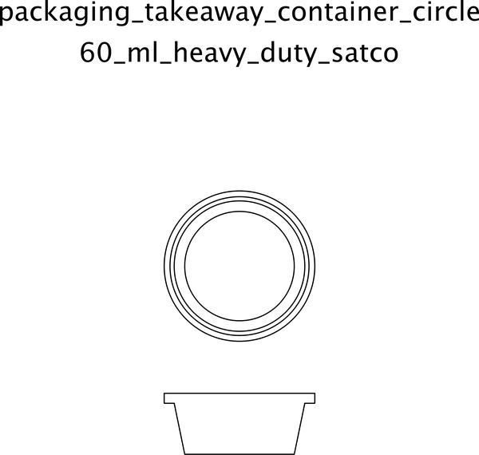

# Packaging Takeaway Container Circle 60 Ml Heavy Duty Satco  

note: This is part of OOMP the Oopen Organization Method For Parts. For more details: https://github.com/oomlout/oomp_base

##  part details

### id
* oomp_id: packaging_takeaway_container_circle_60_ml_heavy_duty_satco
  * classification: packaging
  * type: takeaway_container_circle
  * size: 60_ml
  * color: 
  * description_main: heavy_duty
  * description_extra: 
  * manufacturer: satco
  * part_number: 

### other_codes
* short_code: tcc60
* oomp_word: blossom heart computer
* oomp_word_emoji :blossom: :heart: :computer:
* md5_6_alpha: 47rzv
* md5_6: 6c0d7b

### all codes 
| key | value |  
| --- | --- |  
| classification | packaging |  
| classification_capital | Packaging |  
| classification_first_letter | p |  
| classification_first_letter_upper | P |  
| classification_upper | PACKAGING |  
| color |  |  
| color_capital |  |  
| color_first_letter |  |  
| color_first_letter_upper |  |  
| color_upper |  |  
| description_extra |  |  
| description_extra_capital |  |  
| description_extra_first_letter |  |  
| description_extra_first_letter_upper |  |  
| description_extra_upper |  |  
| description_main | heavy_duty |  
| description_main_capital | Heavy Duty |  
| description_main_first_letter | h |  
| description_main_first_letter_upper | H |  
| description_main_upper | HEAVY_DUTY |  
| description_only_numbers |  |  
| description_only_numbers_short |   |  
| description_or_color |   |  
| description_or_color_upper |   |  
| directory | parts/packaging_takeaway_container_circle_60_ml_heavy_duty_satco |  
| distributors | [] |  
| github_link | https://github.com/oomlout/oomlout_oomp_part_src/tree/main/parts/packaging_takeaway_container_circle_60_ml_heavy_duty_satco/working |  
| id | packaging_takeaway_container_circle_60_ml_heavy_duty_satco |  
| id_no_class | takeaway_container_circle_60_ml_heavy_duty_satco |  
| id_no_size | heavy_duty_satco |  
| id_no_type | 60_ml_heavy_duty_satco |  
| manufacturer | satco |  
| manufacturer_capital | Satco |  
| manufacturer_first_letter | s |  
| manufacturer_first_letter_upper | S |  
| manufacturer_upper | SATCO |  
| manufacturers | [] |  
| markdown_full | [packaging_takeaway_container_circle_60_ml_heavy_duty_satco](https://github.com/oomlout/oomlout_oomp_part_src/tree/main/parts/packaging_takeaway_container_circle_60_ml_heavy_duty_satco/working)  [Packaging Takeaway Container Circle 60 Ml Heavy Duty Satco](https://github.com/oomlout/oomlout_oomp_part_src/tree/main/parts/packaging_takeaway_container_circle_60_ml_heavy_duty_satco/working)   |  
| markdown_short | [packaging_takeaway_container_circle_60_ml_heavy_duty_satco](https://github.com/oomlout/oomlout_oomp_part_src/tree/main/parts/packaging_takeaway_container_circle_60_ml_heavy_duty_satco/working)   |  
| md5 | 6c0d7b99ab71db88e46f9395f6c6de95 |  
| md5_10 | 6c0d7b99ab |  
| md5_10_upper | 6C0D7B99AB |  
| md5_5 | 6c0d7 |  
| md5_5_upper | 6C0D7 |  
| md5_6 | 6c0d7b |  
| md5_6_alpha | 47rzv |  
| md5_6_alpha_upper | 47RZV |  
| md5_6_upper | 6C0D7B |  
| name | Packaging Takeaway Container Circle 60 Ml Heavy Duty Satco |  
| name_no_class | Takeaway Container Circle 60 Ml Heavy Duty Satco |  
| name_no_size | Heavy Duty Satco |  
| name_no_size_short | Heavy Duty Satco |  
| name_no_type | 60 Ml Heavy Duty Satco |  
| oomlout_short_code | tcc60 |  
| oomlout_short_code_upper | TCC60 |  
| oomp_key | oomp_packaging_takeaway_container_circle_60_ml_heavy_duty_satco |  
| oomp_word | blossom heart computer |  
| oomp_word_emoji | :blossom: :heart: :computer: |  
| oomp_word_emoji_list | [':blossom:', ':heart:', ':computer:'] |  
| oomp_word_list | ['blossom', 'heart', 'computer'] |  
| part_number |  |  
| part_number_capital |  |  
| part_number_first_letter |  |  
| part_number_first_letter_upper |  |  
| part_number_upper |  |  
| short_code |  |  
| short_code_upper |  |  
| short_name |  |  
| size | 60_ml |  
| size_capital | 60 Ml |  
| size_first_letter | 6 |  
| size_first_letter_upper | 6 |  
| size_only_numbers | 60 |  
| size_only_numbers_no_zeros | 6 |  
| size_upper | 60_ML |  
| type | takeaway_container_circle |  
| type_capital | Takeaway Container Circle |  
| type_first_letter | t |  
| type_first_letter_upper | T |  
| type_upper | TAKEAWAY_CONTAINER_CIRCLE |  
| files | ['base.yaml', 'drawing.cdr', 'drawing.pdf', 'drawing.png', 'drawing.svg', 'drawing_300.png', 'drawing_600.png', 'label_15_mm_30_mm.pdf', 'label_15_mm_30_mm.svg', 'label_76_2_mm_50_8_mm.pdf', 'label_76_2_mm_50_8_mm.svg', 'label_oomlout_76_2_mm_50_8_mm.pdf', 'label_oomlout_76_2_mm_50_8_mm.svg', 'readme.md', 'working.json', 'working.yaml'] |  
