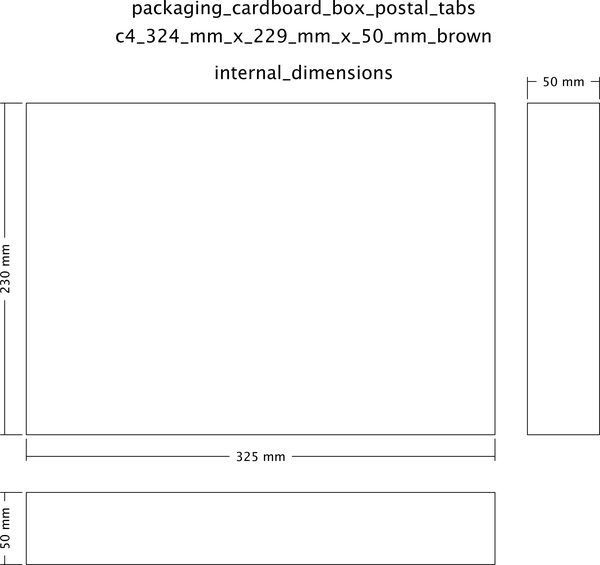
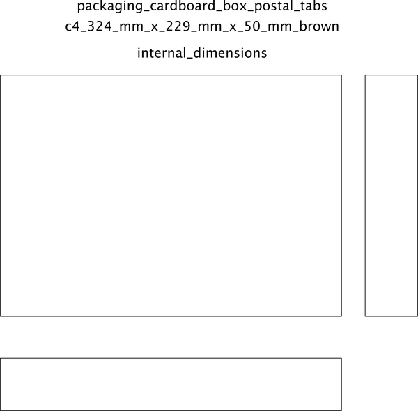

# Packaging Cardboard Box Postal Tabs C4 324 mm X 229 mm X 50 mm Brown  

note: This is part of OOMP the Oopen Organization Method For Parts. For more details: https://github.com/oomlout/oomp_base

##  part details

### id
* oomp_id: packaging_cardboard_box_postal_tabs_c4_324_mm_x_229_mm_x_50_mm_brown
  * classification: packaging
  * type: cardboard_box_postal_tabs
  * size: c4_324_mm_x_229_mm_x_50_mm
  * color: brown
  * description_main: 
  * description_extra: 
  * manufacturer: 
  * part_number: 

### other_codes
* short_code: 
* oomp_word: thumbsup recycle parking
* oomp_word_emoji :thumbsup: :recycle: :parking:
* md5_6_alpha: wav1
* md5_6: 16fefd

### all codes 
| key | value |  
| --- | --- |  
| classification | packaging |  
| classification_length_1 | p |  
| classification_length_2 | pa |  
| classification_length_3 | pac |  
| classification_length_4 | pack |  
| classification_length_5 | packa |  
| classification_length_6 | packag |  
| classification_name | Packaging |  
| classification_no_space_length_1 | p |  
| classification_no_space_length_2 | pa |  
| classification_no_space_length_3 | pac |  
| classification_no_space_length_4 | pack |  
| classification_no_space_length_5 | packa |  
| classification_no_space_length_6 | packag |  
| classification_no_space_upper_length_1 | P |  
| classification_no_space_upper_length_2 | PA |  
| classification_no_space_upper_length_3 | PAC |  
| classification_no_space_upper_length_4 | PACK |  
| classification_no_space_upper_length_5 | PACKA |  
| classification_no_space_upper_length_6 | PACKAG |  
| classification_upper_length_1 | P |  
| classification_upper_length_2 | PA |  
| classification_upper_length_3 | PAC |  
| classification_upper_length_4 | PACK |  
| classification_upper_length_5 | PACKA |  
| classification_upper_length_6 | PACKAG |  
| color | brown |  
| color_length_1 | b |  
| color_length_2 | br |  
| color_length_3 | bro |  
| color_length_4 | brow |  
| color_length_5 | brown |  
| color_length_6 | brown |  
| color_name | Brown |  
| color_no_space_length_1 | b |  
| color_no_space_length_2 | br |  
| color_no_space_length_3 | bro |  
| color_no_space_length_4 | brow |  
| color_no_space_length_5 | brown |  
| color_no_space_length_6 | brown |  
| color_no_space_upper_length_1 | B |  
| color_no_space_upper_length_2 | BR |  
| color_no_space_upper_length_3 | BRO |  
| color_no_space_upper_length_4 | BROW |  
| color_no_space_upper_length_5 | BROWN |  
| color_no_space_upper_length_6 | BROWN |  
| color_upper_length_1 | B |  
| color_upper_length_2 | BR |  
| color_upper_length_3 | BRO |  
| color_upper_length_4 | BROW |  
| color_upper_length_5 | BROWN |  
| color_upper_length_6 | BROWN |  
| description_extra |  |  
| description_extra_name |  |  
| description_main |  |  
| description_main_name |  |  
| directory | parts/packaging_cardboard_box_postal_tabs_c4_324_mm_x_229_mm_x_50_mm_brown |  
| github_link | https://github.com/oomlout/oomlout_oomp_part_src/tree/main/parts/packaging_cardboard_box_postal_tabs_c4_324_mm_x_229_mm_x_50_mm_brown |  
| id | packaging_cardboard_box_postal_tabs_c4_324_mm_x_229_mm_x_50_mm_brown |  
| id_no_class | cardboard_box_postal_tabs_c4_324_mm_x_229_mm_x_50_mm_brown |  
| id_no_color | brown |  
| id_no_size | brown |  
| id_no_type | c4_324_mm_x_229_mm_x_50_mm_brown |  
| manufacturer |  |  
| manufacturer_name |  |  
| md5 | 16fefda0ae6a3e732459dc933ac93556 |  
| md5_10 | 16fefda0ae |  
| md5_10_upper | 16FEFDA0AE |  
| md5_5 | 16fef |  
| md5_5_upper | 16FEF |  
| md5_6 | 16fefd |  
| md5_6_alpha | wav1 |  
| md5_6_alpha_upper | WAV1 |  
| md5_6_upper | 16FEFD |  
| name | Packaging Cardboard Box Postal Tabs C4 324 mm X 229 mm X 50 mm Brown |  
| name_no_class | Cardboard Box Postal Tabs C4 324 mm X 229 mm X 50 mm Brown |  
| name_no_color | Brown |  
| name_no_size | Brown |  
| name_no_type | C4 324 mm X 229 mm X 50 mm Brown |  
| oomp_key | oomp_packaging_cardboard_box_postal_tabs_c4_324_mm_x_229_mm_x_50_mm_brown |  
| oomp_word | thumbsup recycle parking |  
| oomp_word_emoji | :thumbsup: :recycle: :parking: |  
| oomp_word_emoji_list | [':thumbsup:', ':recycle:', ':parking:'] |  
| oomp_word_list | ['thumbsup', 'recycle', 'parking'] |  
| part_number |  |  
| part_number_name |  |  
| size | c4_324_mm_x_229_mm_x_50_mm |  
| size_length_1 | c |  
| size_length_2 | c4 |  
| size_length_3 | c4_ |  
| size_length_4 | c4_3 |  
| size_length_5 | c4_32 |  
| size_length_6 | c4_324 |  
| size_name | C4 324 mm X 229 mm X 50 mm |  
| size_no_space_length_1 | c |  
| size_no_space_length_2 | c4 |  
| size_no_space_length_3 | c43 |  
| size_no_space_length_4 | c432 |  
| size_no_space_length_5 | c4324 |  
| size_no_space_length_6 | c4324m |  
| size_no_space_upper_length_1 | C |  
| size_no_space_upper_length_2 | C4 |  
| size_no_space_upper_length_3 | C43 |  
| size_no_space_upper_length_4 | C432 |  
| size_no_space_upper_length_5 | C4324 |  
| size_no_space_upper_length_6 | C4324M |  
| size_upper_length_1 | C |  
| size_upper_length_2 | C4 |  
| size_upper_length_3 | C4_ |  
| size_upper_length_4 | C4_3 |  
| size_upper_length_5 | C4_32 |  
| size_upper_length_6 | C4_324 |  
| type | cardboard_box_postal_tabs |  
| type_length_1 | c |  
| type_length_2 | ca |  
| type_length_3 | car |  
| type_length_4 | card |  
| type_length_5 | cardb |  
| type_length_6 | cardbo |  
| type_name | Cardboard Box Postal Tabs |  
| type_no_space_length_1 | c |  
| type_no_space_length_2 | ca |  
| type_no_space_length_3 | car |  
| type_no_space_length_4 | card |  
| type_no_space_length_5 | cardb |  
| type_no_space_length_6 | cardbo |  
| type_no_space_upper_length_1 | C |  
| type_no_space_upper_length_2 | CA |  
| type_no_space_upper_length_3 | CAR |  
| type_no_space_upper_length_4 | CARD |  
| type_no_space_upper_length_5 | CARDB |  
| type_no_space_upper_length_6 | CARDBO |  
| type_upper_length_1 | C |  
| type_upper_length_2 | CA |  
| type_upper_length_3 | CAR |  
| type_upper_length_4 | CARD |  
| type_upper_length_5 | CARDB |  
| type_upper_length_6 | CARDBO |  
| files | ['base.yaml', 'dimension.cdr', 'dimension.pdf', 'dimension.png', 'dimension.svg', 'dimension_300.png', 'dimension_600.png', 'drawing.cdr', 'drawing.pdf', 'drawing.png', 'drawing.svg', 'drawing_300.png', 'drawing_600.png', 'label_15_mm_30_mm.pdf', 'label_15_mm_30_mm.svg', 'label_76_2_mm_50_8_mm.pdf', 'label_76_2_mm_50_8_mm.svg', 'label_oomlout_76_2_mm_50_8_mm.pdf', 'label_oomlout_76_2_mm_50_8_mm.svg', 'readme.md', 'working.yaml'] |  
