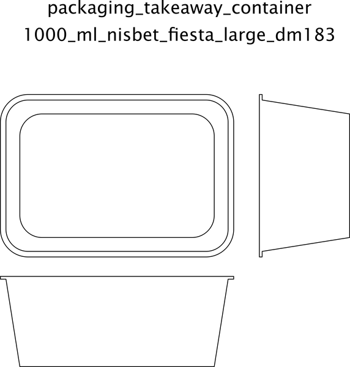

# Packaging Takeaway Container Rectangle 1000 Ml Nisbet Fiesta Large Dm183  

note: This is part of OOMP the Oopen Organization Method For Parts. For more details: https://github.com/oomlout/oomp_base

##  part details

### id
* oomp_id: packaging_takeaway_container_rectangle_1000_ml_nisbet_fiesta_large_dm183
  * classification: packaging
  * type: takeaway_container_rectangle
  * size: 1000_ml
  * color: 
  * description_main: 
  * description_extra: 
  * manufacturer: nisbet_fiesta
  * part_number: large_dm183

### other_codes
* short_code: tcr1000
* oomp_word: hatching_chick bear ring
* oomp_word_emoji :hatching_chick: :bear: :ring:
* md5_6_alpha: 2uv8g
* md5_6: 493ba0

### all codes 
| key | value |  
| --- | --- |  
| classification | packaging |  
| classification_capital | Packaging |  
| classification_first_letter | p |  
| classification_first_letter_upper | P |  
| classification_upper | PACKAGING |  
| color |  |  
| color_capital |  |  
| color_first_letter |  |  
| color_first_letter_upper |  |  
| color_upper |  |  
| description_extra |  |  
| description_extra_capital |  |  
| description_extra_first_letter |  |  
| description_extra_first_letter_upper |  |  
| description_extra_upper |  |  
| description_main |  |  
| description_main_capital |  |  
| description_main_first_letter |  |  
| description_main_first_letter_upper |  |  
| description_main_upper |  |  
| description_only_numbers |  |  
| description_only_numbers_short |   |  
| description_or_color |   |  
| description_or_color_upper |   |  
| directory | parts/packaging_takeaway_container_rectangle_1000_ml_nisbet_fiesta_large_dm183 |  
| distributors | [] |  
| github_link | https://github.com/oomlout/oomlout_oomp_part_src/tree/main/parts/packaging_takeaway_container_rectangle_1000_ml_nisbet_fiesta_large_dm183/working |  
| id | packaging_takeaway_container_rectangle_1000_ml_nisbet_fiesta_large_dm183 |  
| id_no_class | takeaway_container_rectangle_1000_ml_nisbet_fiesta_large_dm183 |  
| id_no_size | nisbet_fiesta_large_dm183 |  
| id_no_type | 1000_ml_nisbet_fiesta_large_dm183 |  
| manufacturer | nisbet_fiesta |  
| manufacturer_capital | Nisbet Fiesta |  
| manufacturer_first_letter | n |  
| manufacturer_first_letter_upper | N |  
| manufacturer_upper | NISBET_FIESTA |  
| manufacturers | [] |  
| markdown_full | [packaging_takeaway_container_rectangle_1000_ml_nisbet_fiesta_large_dm183](https://github.com/oomlout/oomlout_oomp_part_src/tree/main/parts/packaging_takeaway_container_rectangle_1000_ml_nisbet_fiesta_large_dm183/working)  [Packaging Takeaway Container Rectangle 1000 Ml Nisbet Fiesta Large Dm183](https://github.com/oomlout/oomlout_oomp_part_src/tree/main/parts/packaging_takeaway_container_rectangle_1000_ml_nisbet_fiesta_large_dm183/working)   |  
| markdown_short | [packaging_takeaway_container_rectangle_1000_ml_nisbet_fiesta_large_dm183](https://github.com/oomlout/oomlout_oomp_part_src/tree/main/parts/packaging_takeaway_container_rectangle_1000_ml_nisbet_fiesta_large_dm183/working)   |  
| md5 | 493ba0395edb6cdbf8d392393348d874 |  
| md5_10 | 493ba0395e |  
| md5_10_upper | 493BA0395E |  
| md5_5 | 493ba |  
| md5_5_upper | 493BA |  
| md5_6 | 493ba0 |  
| md5_6_alpha | 2uv8g |  
| md5_6_alpha_upper | 2UV8G |  
| md5_6_upper | 493BA0 |  
| name | Packaging Takeaway Container Rectangle 1000 Ml Nisbet Fiesta Large Dm183 |  
| name_no_class | Takeaway Container Rectangle 1000 Ml Nisbet Fiesta Large Dm183 |  
| name_no_size | Nisbet Fiesta Large Dm183 |  
| name_no_size_short | Nisbet Fiesta Large Dm183 |  
| name_no_type | 1000 Ml Nisbet Fiesta Large Dm183 |  
| oomlout_short_code | tcr1000 |  
| oomlout_short_code_upper | TCR1000 |  
| oomp_key | oomp_packaging_takeaway_container_rectangle_1000_ml_nisbet_fiesta_large_dm183 |  
| oomp_word | hatching_chick bear ring |  
| oomp_word_emoji | :hatching_chick: :bear: :ring: |  
| oomp_word_emoji_list | [':hatching_chick:', ':bear:', ':ring:'] |  
| oomp_word_list | ['hatching_chick', 'bear', 'ring'] |  
| part_number | large_dm183 |  
| part_number_capital | Large Dm183 |  
| part_number_first_letter | l |  
| part_number_first_letter_upper | L |  
| part_number_upper | LARGE_DM183 |  
| short_code |  |  
| short_code_upper |  |  
| short_name |  |  
| size | 1000_ml |  
| size_capital | 1000 Ml |  
| size_first_letter | 1 |  
| size_first_letter_upper | 1 |  
| size_only_numbers | 1000 |  
| size_only_numbers_no_zeros | 1 |  
| size_upper | 1000_ML |  
| type | takeaway_container_rectangle |  
| type_capital | Takeaway Container Rectangle |  
| type_first_letter | t |  
| type_first_letter_upper | T |  
| type_upper | TAKEAWAY_CONTAINER_RECTANGLE |  
| files | ['base.yaml', 'dimension.cdr', 'dimension.pdf', 'dimension.png', 'dimension.svg', 'dimension_300.png', 'dimension_600.png', 'drawing.cdr', 'drawing.pdf', 'drawing.png', 'drawing.svg', 'drawing_300.png', 'drawing_600.png', 'label_15_mm_30_mm.pdf', 'label_15_mm_30_mm.svg', 'label_76_2_mm_50_8_mm.pdf', 'label_76_2_mm_50_8_mm.svg', 'label_oomlout_76_2_mm_50_8_mm.pdf', 'label_oomlout_76_2_mm_50_8_mm.svg', 'readme.md', 'working.json', 'working.yaml'] |  
