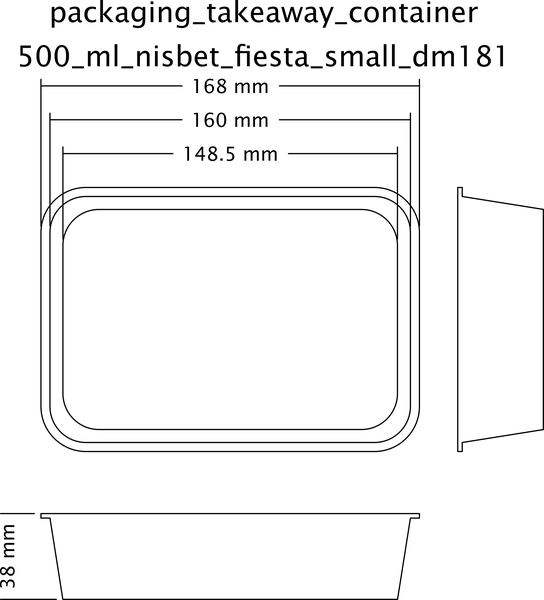
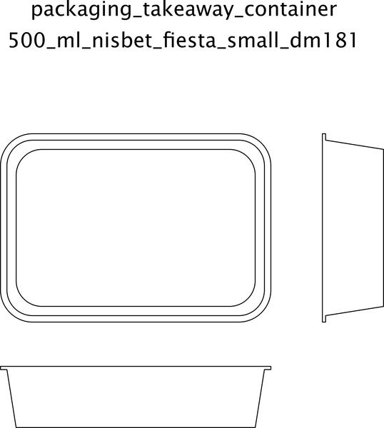

# Packaging Takeaway Container Rectangle 500 Ml Nisbet Fiesta Small Dm181  

note: This is part of OOMP the Oopen Organization Method For Parts. For more details: https://github.com/oomlout/oomp_base

##  part details

### id
* oomp_id: packaging_takeaway_container_rectangle_500_ml_nisbet_fiesta_small_dm181
  * classification: packaging
  * type: takeaway_container_rectangle
  * size: 500_ml
  * color: 
  * description_main: 
  * description_extra: 
  * manufacturer: nisbet_fiesta
  * part_number: small_dm181

### other_codes
* short_code: tcr500
* oomp_word: hammer cupid briefcase
* oomp_word_emoji :hammer: :cupid: :briefcase:
* md5_6_alpha: 5cipd
* md5_6: 890eb1

### all codes 
| key | value |  
| --- | --- |  
| classification | packaging |  
| classification_length_1 | p |  
| classification_length_2 | pa |  
| classification_length_3 | pac |  
| classification_length_4 | pack |  
| classification_length_5 | packa |  
| classification_length_6 | packag |  
| classification_name | Packaging |  
| classification_no_space_length_1 | p |  
| classification_no_space_length_2 | pa |  
| classification_no_space_length_3 | pac |  
| classification_no_space_length_4 | pack |  
| classification_no_space_length_5 | packa |  
| classification_no_space_length_6 | packag |  
| classification_no_space_upper_length_1 | P |  
| classification_no_space_upper_length_2 | PA |  
| classification_no_space_upper_length_3 | PAC |  
| classification_no_space_upper_length_4 | PACK |  
| classification_no_space_upper_length_5 | PACKA |  
| classification_no_space_upper_length_6 | PACKAG |  
| classification_upper_length_1 | P |  
| classification_upper_length_2 | PA |  
| classification_upper_length_3 | PAC |  
| classification_upper_length_4 | PACK |  
| classification_upper_length_5 | PACKA |  
| classification_upper_length_6 | PACKAG |  
| color |  |  
| color_name |  |  
| description_extra |  |  
| description_extra_name |  |  
| description_main |  |  
| description_main_name |  |  
| directory | parts/packaging_takeaway_container_rectangle_500_ml_nisbet_fiesta_small_dm181 |  
| github_link | https://github.com/oomlout/oomlout_oomp_part_src/tree/main/parts/packaging_takeaway_container_rectangle_500_ml_nisbet_fiesta_small_dm181 |  
| id | packaging_takeaway_container_rectangle_500_ml_nisbet_fiesta_small_dm181 |  
| id_no_class | takeaway_container_rectangle_500_ml_nisbet_fiesta_small_dm181 |  
| id_no_color | nisbetfiestasmalldm181 |  
| id_no_size | nisbet_fiesta_small_dm181 |  
| id_no_type | 500_ml_nisbet_fiesta_small_dm181 |  
| manufacturer | nisbet_fiesta |  
| manufacturer_length_1 | n |  
| manufacturer_length_2 | ni |  
| manufacturer_length_3 | nis |  
| manufacturer_length_4 | nisb |  
| manufacturer_length_5 | nisbe |  
| manufacturer_length_6 | nisbet |  
| manufacturer_name | Nisbet Fiesta |  
| manufacturer_no_space_length_1 | n |  
| manufacturer_no_space_length_2 | ni |  
| manufacturer_no_space_length_3 | nis |  
| manufacturer_no_space_length_4 | nisb |  
| manufacturer_no_space_length_5 | nisbe |  
| manufacturer_no_space_length_6 | nisbet |  
| manufacturer_no_space_upper_length_1 | N |  
| manufacturer_no_space_upper_length_2 | NI |  
| manufacturer_no_space_upper_length_3 | NIS |  
| manufacturer_no_space_upper_length_4 | NISB |  
| manufacturer_no_space_upper_length_5 | NISBE |  
| manufacturer_no_space_upper_length_6 | NISBET |  
| manufacturer_upper_length_1 | N |  
| manufacturer_upper_length_2 | NI |  
| manufacturer_upper_length_3 | NIS |  
| manufacturer_upper_length_4 | NISB |  
| manufacturer_upper_length_5 | NISBE |  
| manufacturer_upper_length_6 | NISBET |  
| md5 | 890eb1c195af1b7cb729938cff1a4db3 |  
| md5_10 | 890eb1c195 |  
| md5_10_upper | 890EB1C195 |  
| md5_5 | 890eb |  
| md5_5_upper | 890EB |  
| md5_6 | 890eb1 |  
| md5_6_alpha | 5cipd |  
| md5_6_alpha_upper | 5CIPD |  
| md5_6_upper | 890EB1 |  
| name | Packaging Takeaway Container Rectangle 500 Ml Nisbet Fiesta Small Dm181 |  
| name_no_class | Takeaway Container Rectangle 500 Ml Nisbet Fiesta Small Dm181 |  
| name_no_color | Nisbetfiestasmalldm181 |  
| name_no_size | Nisbet Fiesta Small Dm181 |  
| name_no_type | 500 Ml Nisbet Fiesta Small Dm181 |  
| oomlout_short_code | tcr500 |  
| oomlout_short_code_upper | TCR500 |  
| oomp_key | oomp_packaging_takeaway_container_rectangle_500_ml_nisbet_fiesta_small_dm181 |  
| oomp_word | hammer cupid briefcase |  
| oomp_word_emoji | :hammer: :cupid: :briefcase: |  
| oomp_word_emoji_list | [':hammer:', ':cupid:', ':briefcase:'] |  
| oomp_word_list | ['hammer', 'cupid', 'briefcase'] |  
| part_number | small_dm181 |  
| part_number_length_1 | s |  
| part_number_length_2 | sm |  
| part_number_length_3 | sma |  
| part_number_length_4 | smal |  
| part_number_length_5 | small |  
| part_number_length_6 | small_ |  
| part_number_name | Small Dm181 |  
| part_number_no_space_length_1 | s |  
| part_number_no_space_length_2 | sm |  
| part_number_no_space_length_3 | sma |  
| part_number_no_space_length_4 | smal |  
| part_number_no_space_length_5 | small |  
| part_number_no_space_length_6 | smalld |  
| part_number_no_space_upper_length_1 | S |  
| part_number_no_space_upper_length_2 | SM |  
| part_number_no_space_upper_length_3 | SMA |  
| part_number_no_space_upper_length_4 | SMAL |  
| part_number_no_space_upper_length_5 | SMALL |  
| part_number_no_space_upper_length_6 | SMALLD |  
| part_number_upper_length_1 | S |  
| part_number_upper_length_2 | SM |  
| part_number_upper_length_3 | SMA |  
| part_number_upper_length_4 | SMAL |  
| part_number_upper_length_5 | SMALL |  
| part_number_upper_length_6 | SMALL_ |  
| size | 500_ml |  
| size_length_1 | 5 |  
| size_length_2 | 50 |  
| size_length_3 | 500 |  
| size_length_4 | 500_ |  
| size_length_5 | 500_m |  
| size_length_6 | 500_ml |  
| size_name | 500 Ml |  
| size_no_space_length_1 | 5 |  
| size_no_space_length_2 | 50 |  
| size_no_space_length_3 | 500 |  
| size_no_space_length_4 | 500m |  
| size_no_space_length_5 | 500ml |  
| size_no_space_length_6 | 500ml |  
| size_no_space_upper_length_1 | 5 |  
| size_no_space_upper_length_2 | 50 |  
| size_no_space_upper_length_3 | 500 |  
| size_no_space_upper_length_4 | 500M |  
| size_no_space_upper_length_5 | 500ML |  
| size_no_space_upper_length_6 | 500ML |  
| size_upper_length_1 | 5 |  
| size_upper_length_2 | 50 |  
| size_upper_length_3 | 500 |  
| size_upper_length_4 | 500_ |  
| size_upper_length_5 | 500_M |  
| size_upper_length_6 | 500_ML |  
| type | takeaway_container_rectangle |  
| type_length_1 | t |  
| type_length_2 | ta |  
| type_length_3 | tak |  
| type_length_4 | take |  
| type_length_5 | takea |  
| type_length_6 | takeaw |  
| type_name | Takeaway Container Rectangle |  
| type_no_space_length_1 | t |  
| type_no_space_length_2 | ta |  
| type_no_space_length_3 | tak |  
| type_no_space_length_4 | take |  
| type_no_space_length_5 | takea |  
| type_no_space_length_6 | takeaw |  
| type_no_space_upper_length_1 | T |  
| type_no_space_upper_length_2 | TA |  
| type_no_space_upper_length_3 | TAK |  
| type_no_space_upper_length_4 | TAKE |  
| type_no_space_upper_length_5 | TAKEA |  
| type_no_space_upper_length_6 | TAKEAW |  
| type_upper_length_1 | T |  
| type_upper_length_2 | TA |  
| type_upper_length_3 | TAK |  
| type_upper_length_4 | TAKE |  
| type_upper_length_5 | TAKEA |  
| type_upper_length_6 | TAKEAW |  
| files | ['base.yaml', 'dimension.cdr', 'dimension.pdf', 'dimension.png', 'dimension.svg', 'dimension_300.png', 'dimension_600.png', 'drawing.cdr', 'drawing.pdf', 'drawing.png', 'drawing.svg', 'drawing_300.png', 'drawing_600.png', 'label_15_mm_30_mm.pdf', 'label_15_mm_30_mm.svg', 'label_76_2_mm_50_8_mm.pdf', 'label_76_2_mm_50_8_mm.svg', 'label_oomlout_76_2_mm_50_8_mm.pdf', 'label_oomlout_76_2_mm_50_8_mm.svg', 'readme.md', 'working.yaml'] |  
